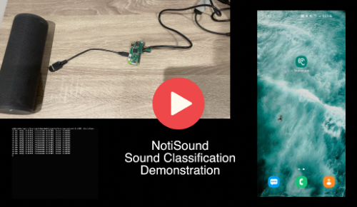

# NotiSound

##### Embedded Systems Course

🔔 🙉 Get notified of sounds around you

---

 

## Repository structure

- **[node_device](node_device/)**: This folder contains all the code that is running on our IoT edge device (Raspberry Pi Zero).

- **[edge_impulse](edge_impulse/)**: This folder contains the custom dataset used for training, as well as a presentation on the Edge Impule ML pipeline.

- **[mobile_app](mobile_app/)**: This folder contains all our files for the mobile app.

- **[website](website/)**: This folder contains all the code needed to create the website.

##

 

## Check out our Website: [notisound.waqua.xyz](http://notisound.waqua.xyz/)

You'll find there a feature and project overview as well as the **advertising/marketing video**.

For a more **technical demonstration**, similar to the one done in the poster session, you can watch the following video:

<a href="https://youtu.be/70v0xNBIKIo">
    
     
    Click to watch the technical demo
</a>

##

 

## Authors

- [Tanguy](http://github.com/tlp19/)

- [Daniel](http://github.com/danieljohnromano/)

- [Riccardo](http://github.com/riccardo927/)

- [Timeo](http://github.com/timeo-schmidt/)

##

