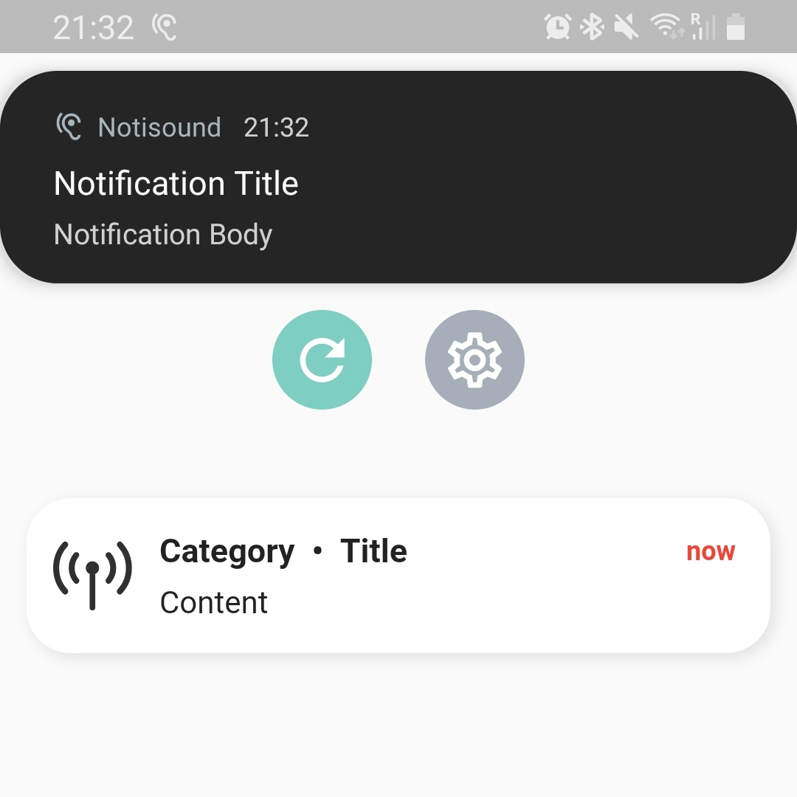

# Sending FCM messages to the Notisound app using PyFCM

These are the instructions to follow in order to send messages to the app using FCM.
There is also a [demo python script](./FCM_using_PyFCM.py) that compiles what is written here and should be easy to adapt for whatever messages you need to send.

<br/>

## What is FCM?

Firebase Cloud Messaging (FCM) is a Google service used to send notifications and data payloads to remote devices using a publish-subscribe model, just like the MQTT protocol.
This is what is used in the Notisound app to receive messages from the Raspberry PIs.

<br/>

## How to send a message ?

### 1. Installing the relevant library

**Pre-requisite: you need a device with a working install Python (recommended Python3)**

To use FCM, you need to install the `PyFCM` library on the device (either your laptop for testing, or the Raspberry Pi for the final product).
To do so, run the following command in a terminal:
```terminal
$ pip3 install pyfcm
```
*If that doesn't work, try with `pip` instead of `pip3`.*

<br/>

### 2. Initializing the FCM service

Once the library has been installed, you can import it in a Python script as follows:
```python
from pyfcm import FCMNotification
```

We can then initialize the service by giving it the Firebase Project API key:
```python
push_service = FCMNotification(api_key= <api_key_here>)
```

<br/>

### 3. Creating a message to send

FCM handles 2 types of notifications/messages :
- Proper notifications that get displayed on the user's phone (like pop-up notifications from WhatsApp)
- Data-only messages that just send a payload to the app directly (like a MQTT message)

We want to do both, and thankfully this is easily done by just giving the two to the FCM service.

<br/>

#### a. Create a display notification

The app already takes care of the icon of the notification, so all we have to do is give it a title and a body:
```python
message_title = "Notification Title"
message_body = "Notification Body"
```

<br/>

#### b. Create the data payload to be passed onto the app

The payload is a Python dictionary with `strings` as keys, and as the app also needs `strings` for the values, we get:
```python
data_message = {                  
    "title" : "Title",
    "content" : "Content",
    "category" : "Category",
    "author" : "Author"
}
```

Let's explain what each entry is in a bit more details:
- `"title"` : this is the title of the message displayed in the app
- `"content"` : this is the content of the message displayed in the app (so far so good)
- `"category"` : the category of the message is displayed right before the title of the message, please refer to the screenshot below to understand the layout more easily
- `"author"` : this is the `deviceID` of the device that sent the message, but it is not diplayed in the app. More details on `devideID`s will be given in the next section.


The black notification is the Pop-up notification from Android, and in the background is the app with the white message that is created from the payload.

<br/>
<br/>

### 4. Sending the message to a topic

#### a. Choosing a topic

First define a topic to send the message to:
```python
topic_name = "test_test"
```

All topics are in the format `<deviceID>_<category>` where `<deviceID>` is the unique ID of the physical device that you want to subscribe to (like a serial number), and `<category>` is the category of the messages that you want to receive from that device.

For example, a device with `deviceID = abc123` could be placed near a smoke detector. Therefore, every messages related to that should be sent to the topic `abc123_smoke_detector`.
The exact `<category>` is not *that* important, but it should be the same between **all devices**, and between **all messages related to that category** that are sent: you can't have one device sending to `abc123_smoke_detector` and the other one sending to `def456_fire_alarm` for messages both related to a smoke detector going off.

*Note: `<category>` should be the same as the `'category':` entry of the message defined earlier, but formatted in a continuous string, so for example `fire_alarm` instead of `'Fire Alarm'`.*

<br/>

#### b. Sending the message

Given a topic, the message and payload can then be sent using the following function:
```python
result = push_service.notify_topic_subscribers(topic_name=topic_name, message_body=message_body, message_title=message_title, data_message=data_message, content_available=True)
```
where we have set `content_available=True` for background messages to work on iOS.

*Note: storing the result of the `push_service.notify_topic_subscribers` is not needed, but it can be printed out with `print(result)` to check that the message was correctly sent, and help with debugging.*
