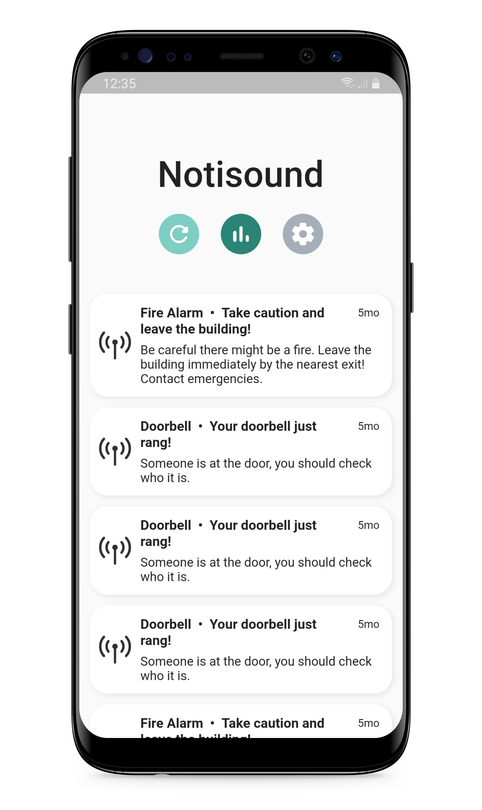
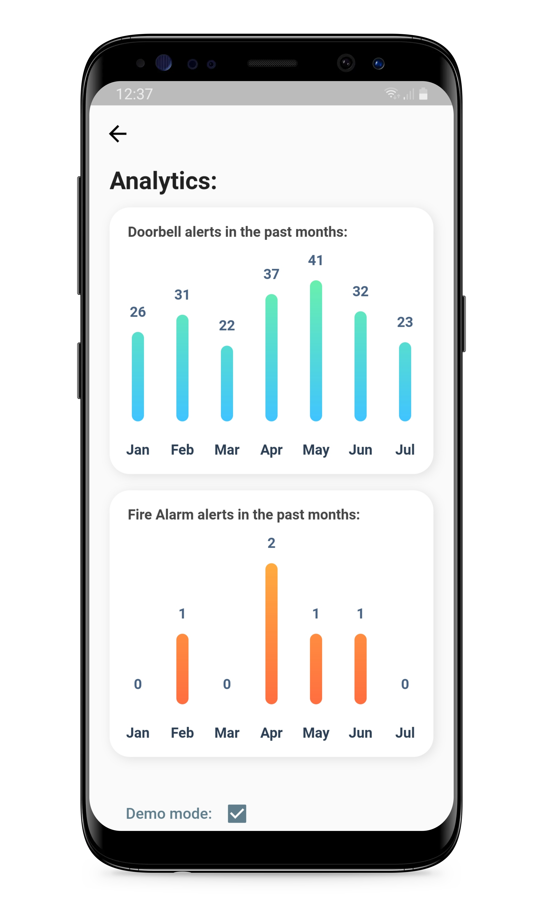
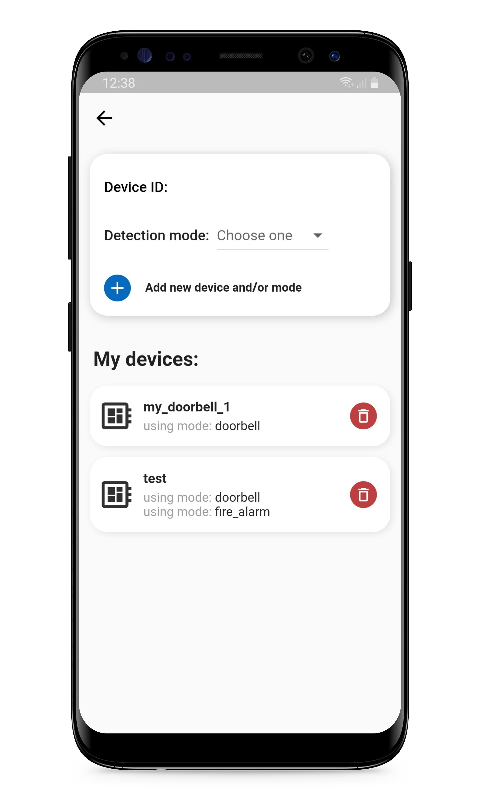

# :iphone: NotiSound Mobile Application

## Screenshots

  

## Folder stucture

You can find instructions on how to use the app [here](./return_success_4_app/README.md).

As this is a Flutter project, the codebase of the app is located in [`./return_success_4_app/lib/`](./return_success_4_app/lib/). You can also view it in the [original GitHub repository of the app](https://github.com/tlp19/return_success_4_app).
